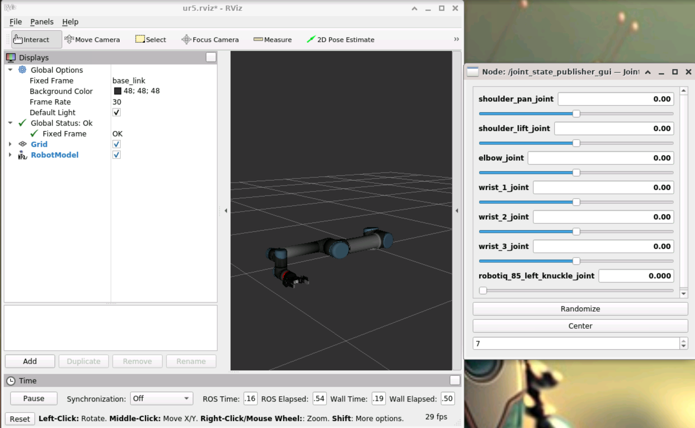
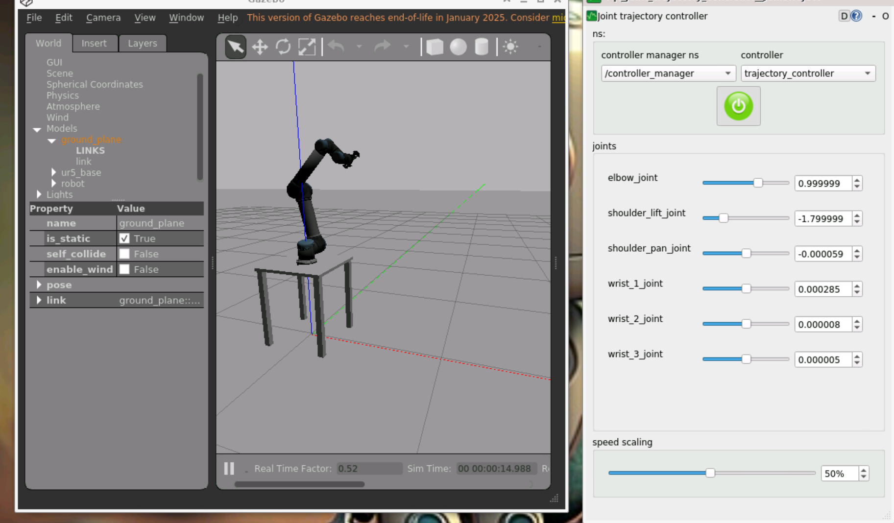
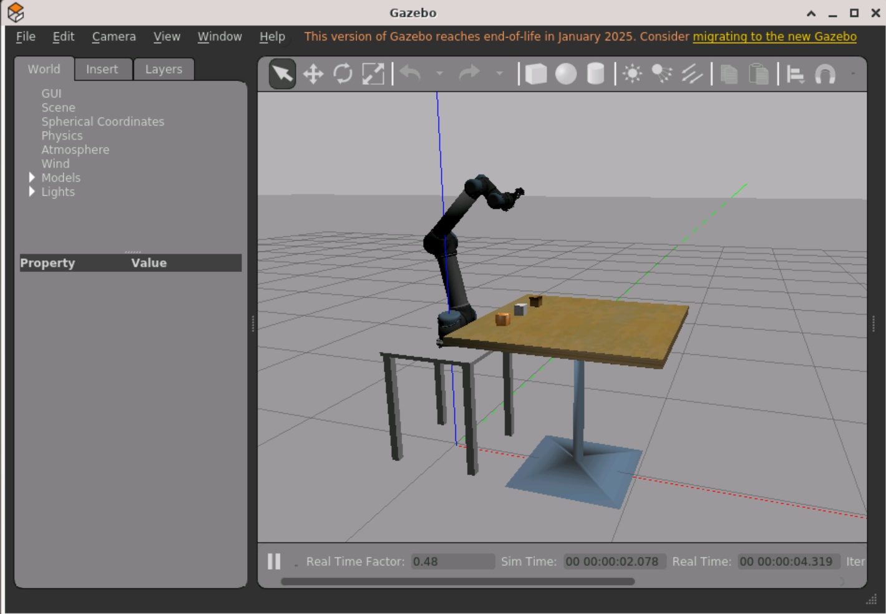

# Pick and Place - UR5 + Robotiq gripper

Como executar:
Você pode executar em sua máquina local ou via GitHub Codespaces. Se for executar no seu computador é necessária a preparação do ambiente local, caso contrário vá para a seção ["Tutorial Via GitHub Codespaces"](#tutorial-via-github-codespaces).

## Preparação do ambiente na máquina local - git + docker + vscode

1. Verifique se o git está instalado

    ```bash
    git --version
    ```

    1.1 - Se não estiver instalar:

    ```bash
    sudo apt install git
    ```

2. Baixar o repositorio em sua máquina local:

    ```bash
    git clone https://github.com/NURIA-IFSP/LabVir_moveit_ur10_lab1.git
    ```

3. Abrir o vscode no diretório do projeto:

    ```bash
    code LabVir_moveit_ur10_moveit_lab01
    ```

4. Garanta que o docker esteja instalado e rodando:

    ```bash
        docker --version
    ```

5. Se não tiver, instalar o docker:

    [Docker Installation Guide](https://docs.docker.com/get-started/get-docker/)

6. Instale a extensão remote - developement: workspace, no vscode:

    - No menu de extensões do VsCode Ctrl + Shift + X procure por: Remote - Development: Workspace

## Execução do container no vscode

1. Clique no botão de play no canto inferior esquerdo do vscode:
    

2. Clique em "Reopen in Container"

3. Aguarde o container ser iniciado, o vscode irá reiniciar e abrir novamente. (Isso deve levar alguns minutos)

## Abra o ambiente de desenvolvimento no seu browser

1. Abra o terminal PORTS do vscode com o atalho: Ctrl + Shift + P - Forward a Port

2. Clique na primeira porta que estará mapeada no endereço:  <http://localhost:6080>

3. O ambiente XFCE4 deverá abrir no seu browser

4. Se desejar, ajuste a resolução para o seu monitor clicando no canto superior esquerdo do ambiente XFCE4 e selecionando "Display Settings"

5. Clique no botão para estender a exibição para a tela inteira - atalho: Ctrl + Shift + F12

6. Clique no ícone da área de trabalho - "Init_ROS"

    Isso deverá abrir o terminal e exibir a preparação do ambiente ROS (deve levar alguns minutos.)

7. Abra um terminal "Applications -> Terminal Emulator"

8. Mude para o diretorio /LabVir_moveit_ur10_lab1/catkin_ws

## Visualização do braço robótico no RVIz

9. Execute o comando:

```bash
    source devel/setup.bash
    roslaunch ur5_description display_with_gripper.launch
```

Como alternativa você pode executar o script que abre e dimensiona as janelas no xfce4:
    ``bash
        cd /LabVir_moveit_ur10_lab1/catkin_ws/src/ur10_with_gripper/scripts
        ./init_view_robot_with_gripper.sh
    ```
    
O RViz deverá abrir com esta tela:



Você poderá movimentar os slides laterais para movimentação e teste do braço robótico

## Simulação do braço robótico no simulador Gazebo com a garra

1. Para verificar a simulação do UR5 com a garra no Gazebo:

```bash
    roslaunch ur_gazebo ur5_gazebo.launch
```

O Gazebo deverá abrir com esta tela:


Para executar a simulação clique no botão "play" no canto inferior esquerdo do gazebo. No rqt_joint_trajectory_controller você
deverá carregar o controller manager e controllers conforme a figura para controlar o braço robótico.

## Movimentação do braço robótico através de programação Python

Você poderá executar alguns scripts para movimentação do braço robótico.

1. Carregue o braço robótico no ambiente do gazebo com a mesa e os cubos:

```bash
    roslaunch ur5_gazebo ur5_cubes.launch
```
Após iniciar a simulação clicando em "play" no canto inferior esquerdo o Gazebo deverá exibir esta tela:




Para movimentação da garra, execute o script em um novo terminal:

```bash
    rosrun ur5_gazebo send_gripper.py --value 0.5
```

__Importante:__ sempre que for abrir um terminal execute os comandos:

```bash
    cd catkin_ws
    source devel/setup.bash
```
Ao executar o script você verá a garra se movimentar (valor 0.0 fecha a garra e 0.8 abre)

Este script movimenta o braço robótico:

```bash
    rosrun ur5_gazebo send_joints.py
```

A posição que o braço irá se mover é definido dentro do script nesta linha:
```Python
 pts.positions = [0.0, -2.33, 1.57, 0.0, 0.0, 0.0]
```
Altere os valores dos angulos das juntas (em radianos) e veja o que ocorre.


## Tutorial Via GitHub Codespaces

Na execução via github Codespaces você não precisará instalar nada em seu computador, terá apenas que ter uma conta no github.

1. Acesse o repositório do projeto no github:
    [https://github.com/NURIA-IFSP/LabVir_moveit_tutorial](https://github.com/NURIA-IFSP/LabVir_moveit_tutorial)
    - Clique no botão "Code" e selecione "Codespaces"
    - O ambiente começará a ser montado no Codespaces (isso pode levar alguns minutos)

2. Feito isso abra o ambiente de desenvolvimento no seu browser, conforme explicado anteriormente e siga os mesmos passos.

3. Avisos Importantes para simulação usando Codespaces:
    - Após a execução do ambiente você deverá clicar no botão "Stop" para encerrar o ambiente.
    - A execução de ambientes de desenvolvimento é cobrada pelo github, havendo um limite atual de 60 horas de execução por mês, ou 180 horas por mês para usuários com acesso premium. Estudantes e professores podem ter o limite aumentado.
